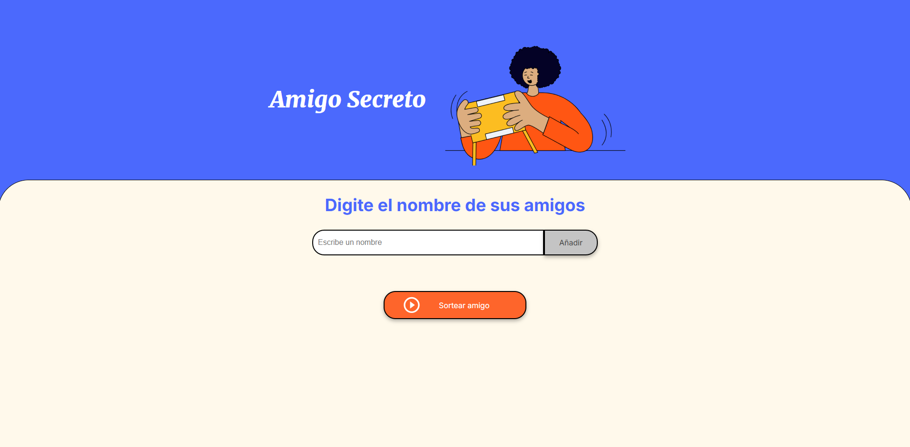

<h1>Juego del amigo secreto</h1>

Este es un juego que consiste en ingresar varios nombres de amigos y al sortearlos el sistema le devolvera uno

pasos para jugar el juego:

<ol>
  <li>ingrese el nombre del amigo que desea añadir en el cuadro de texto y despues presione el boton añadir. recuerde que no puede dejar esta casilla vacia</li>
  <li>cuando ya termine de añadir los amigos presione el boton sortear amigo y el sistema le devolvera el amigo secreto, y si desea seguir jugando vuelva a ingresar amigos y presione nuevamente el boton sortear</li>
</ol>

